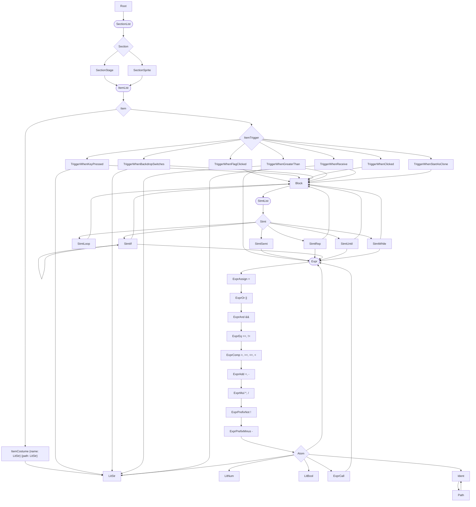

```mermaid
graph TD
  ItemCostume["ItemCostume {name: LitStr} {path: LitStr}"]

  Root --> SectionList
  SectionList(["SectionList"])
  SectionList --> Section

  Section{"Section"}
  Section --> SectionStage
  SectionStage --> ItemList

  Section --> SectionSprite
  SectionSprite --> ItemList

  ItemList(["ItemList"])
  ItemList --> Item

  Item{"Item"}
  Item --> ItemCostume
  Item --> ItemTrigger

  ItemCostume --> LitStr

  ItemTrigger{"ItemTrigger"}
  ItemTrigger --> TriggerWhenFlagClicked
  ItemTrigger --> TriggerWhenKeyPressed
  ItemTrigger --> TriggerWhenClicked
  ItemTrigger --> TriggerWhenBackdropSwitches
  ItemTrigger --> TriggerWhenGreaterThan
  ItemTrigger --> TriggerWhenReceive
  ItemTrigger --> TriggerWhenStartAsClone

  TriggerWhenFlagClicked --> Block

  TriggerWhenKeyPressed --> Block
  TriggerWhenKeyPressed --> LitStr

  TriggerWhenClicked --> Block

  TriggerWhenBackdropSwitches --> Block
  TriggerWhenBackdropSwitches --> LitStr

  TriggerWhenGreaterThan --> Block
  TriggerWhenGreaterThan --> LitStr
  TriggerWhenGreaterThan --> Expr

  TriggerWhenReceive --> Block
  TriggerWhenReceive --> LitStr

  TriggerWhenStartAsClone --> Block

  ExprAssign["ExprAssign ="]
  ExprOr["ExprOr ||"]
  ExprAnd["ExprAnd &&"]
  ExprEq["ExprEq ==, !="]
  ExprComp["ExprComp >, >=, <=, <"]
  ExprAdd["ExprAdd +, -"]
  ExprMul["ExprMul *, /"]
  ExprPrefixNot["ExprPrefixNot !"]
  ExprPrefixMinus["ExprPrefixMinus -"]

  Expr(["Expr"])
  Expr --> ExprAssign
  ExprAssign --> ExprOr
  ExprOr --> ExprAnd
  ExprAnd --> ExprEq
  ExprEq --> ExprComp
  ExprComp --> ExprAdd
  ExprAdd --> ExprMul
  ExprMul --> ExprPrefixNot
  ExprPrefixNot --> ExprPrefixMinus
  ExprPrefixMinus --> Atom

  Atom{"Atom"}
  Atom --> LitNum
  Atom --> LitStr
  Atom --> LitBool
  Atom --> ExprCall
  Atom --> Expr
  Atom --> Ident

  ExprCall --> Expr

  Ident --> Path
  Path --> Ident

  LitNum
  LitStr
  LitBool

  Stmt{"Stmt"}

  Stmt --> StmtSemi
  StmtSemi --> Expr

  Stmt --> StmtRep
  StmtRep --> Expr
  StmtRep --> Block

  Stmt --> StmtLoop
  StmtLoop --> Block

  Stmt --> StmtIf
  StmtIf --> Expr
  StmtIf --> Block
  StmtIf --> StmtIf

  Stmt --> StmtUntil
  StmtUntil --> Expr
  StmtUntil --> Block

  Stmt --> StmtWhile
  StmtWhile --> Expr
  StmtWhile --> Block

  Block --> StmtList
  StmtList(["StmtList"])
  StmtList --> Stmt
```
